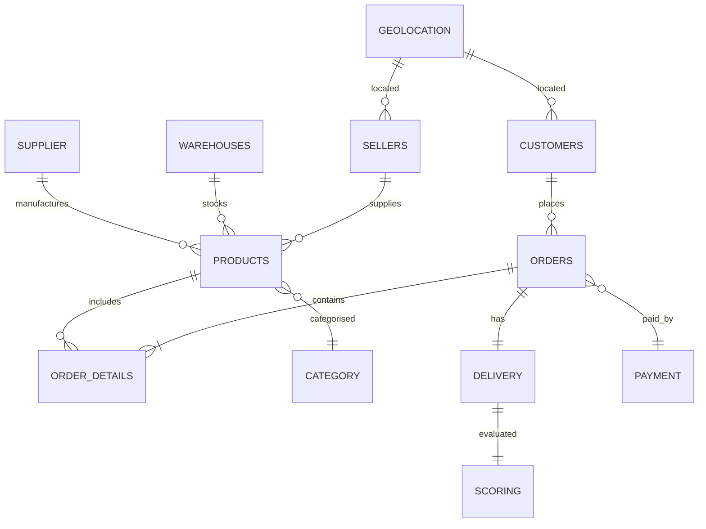

# E-Commerce Database & Analytics Platform


A fully normalised relational database and business intelligence solution for a musical-instrument e-commerce platform. Built on 100k+ real Brazilian orders (Olist dataset), this project delivers a star-schema data model, analytical SQL views, and a multi-page Power BI dashboard for end-to-end retail performance monitoring.

---

## Architecture

```
┌──────────────────────┐     ┌──────────────────────┐     ┌──────────────────┐
│  Raw CSV Data        │────▶│  Normalised SQLite    │────▶│  Power BI        │
│  (9 Olist tables)   │     │  Database             │     │  Dashboard       │
│                      │     │  (12+ entities)      │     │  (4 pages)       │
└──────────────────────┘     └──────────┬───────────┘     └──────────────────┘
                                         │
                                         ▼
                                ┌──────────────────┐
                                │  Star-Schema     │
                                │  SQL Views       │
                                │  - FactOrders    │
                                │  - DimCustomer   │
                                │  - DimProduct    │
                                │  - DimSeller     │
                                │  - DimCalendar   │
                                │  - CalcDelivery  │
                                └──────────────────┘
```

### ER Diagram (Star Schema)



---

## Key Features

- **Normalised Schema** — 12+ entities in 3NF with foreign key constraints
- **SQL Views for BI** — Star-schema views (`v_FactOrders`, `v_DimCustomer`, `v_DimProduct`, `v_DimSeller`, `v_DimCalendar`, `v_CalcDeliveryKPIs`) optimised for Power BI import
- **DAX Measures** — Total Revenue, Average Order Value (AOV), On-Time Delivery %, Revenue MoM %, Review Score Average
- **Power BI Dashboard** — 4 pages: Executive Summary, Sales & Products, Customers & Reviews, Delivery & Operations
- **Colour Palette** — Custom brand theme: `#1E3A5F`, `#F5A623`, `#7ED321`, `#D0021B`

---

## Dataset

Source: [Brazilian E-Commerce Public Olist Dataset](https://www.kaggle.com/datasets/olistbr/brazilian-ecommerce) (100k+ orders, 2016–2018)

| Table | Rows | Description |
|-------|------|-------------|
| `olist_customers_dataset` | 99k | Customer demographics & geolocation |
| `olist_orders_dataset` | 99k | Order timestamps & status |
| `olist_order_items_dataset` | 113k | Product-level order lines |
| `olist_order_payments_dataset` | 103k | Payment method & instalments |
| `olist_order_reviews_dataset` | 99k | Customer review scores & comments |
| `olist_products_dataset` | 33k | Product attributes (weight, dimensions, category) |
| `olist_sellers_dataset` | 3k | Seller details & geolocation |
| `olist_geolocation_dataset` | 1M | ZIP code lat/lon coordinates |

---

## Project Structure

```
├── e-commerce_final code.db    # SQLite database (populated)
├── powerbi_queries.sql         # Star-schema SQL views for Power BI
├── POWERBI_DASHBOARD.md        # Dashboard build guide with DAX measures
├── e Commerce DB.drawio        # Editable ER diagram (draw.io)
├── requirements.txt
└── data/                       # Raw Olist CSVs
    ├── olist_customers_dataset.csv
    ├── olist_orders_dataset.csv
    ├── olist_order_items_dataset.csv
    ├── olist_order_payments_dataset.csv
    ├── olist_order_reviews_dataset.csv
    ├── olist_products_dataset.csv
    ├── olist_sellers_dataset.csv
    ├── olist_geolocation_dataset.csv
    └── product_category_name_translation.csv
```

---

## Installation

```bash
git clone https://github.com/Piyali-Narnaware/E-commerce.git
cd E-commerce
pip install -r requirements.txt
```

To explore the database:

```bash
sqlite3 e-commerce_final_code.db
.tables
```

To build the Power BI dashboard, follow the guide in [`POWERBI_DASHBOARD.md`](POWERBI_DASHBOARD.md).

---

## Key Results

- **12+ normalised entities** enforcing referential integrity
- **Star-schema SQL views** reducing Power BI query complexity
- **DAX measures** enabling real-time KPI tracking
- Dashboard tracks **Revenue, AOV, On-Time Delivery %, Review Scores** across geographic and temporal dimensions
