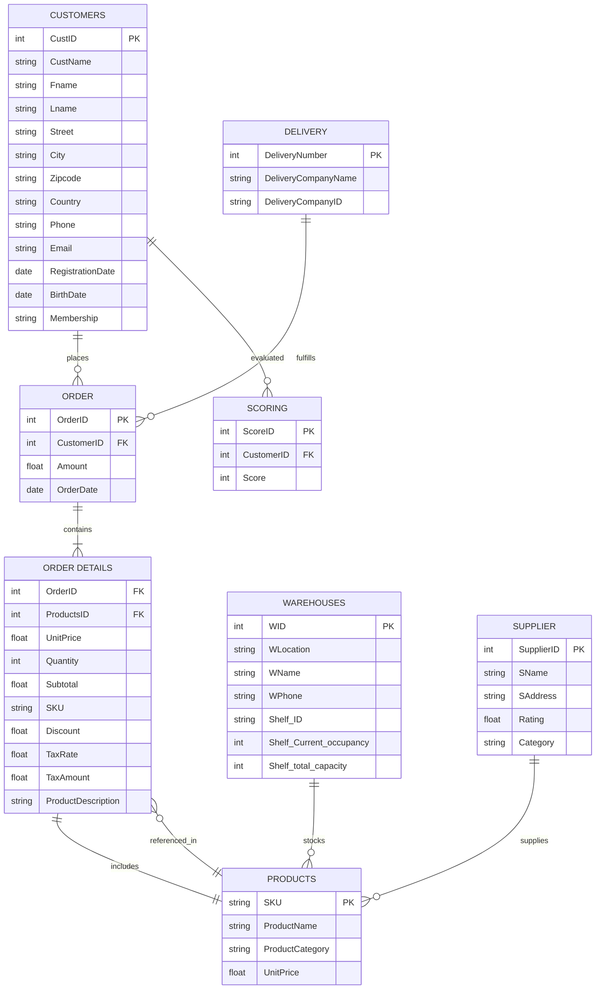

# E-commerce Platform — Musical Instruments

Database design and data analysis for an e-commerce platform specializing in musical instruments.

## Purpose

Build a complete relational database model for an online musical instrument store, populate it with realistic e-commerce data, and enable analytical queries on sales, inventory, customers, and suppliers.

## Schema



**Entities:** Customers, Orders, Order Details, Products, Payment (Coupon, Debit Card, Credit Card), Delivery, Warehouses (with shelf management), Suppliers, Stores, Transactions, Categories, Ads, Scoring.

## Tools Used

- **SQLite** — relational database engine
- **draw.io / diagrams.net** — ER diagram
- **Python** (pandas, numpy, matplotlib, seaborn, plotly) — data processing and analysis
- **Jupyter** — interactive exploration

## Results

- Normalized database schema with 12+ entities and defined relationships (PK/FK)
- SQLite database (`e-commerce_final code.db`) populated with order, customer, product, and seller data
- Product attribute catalog (`Product attributes copy.xlsx`)
- Full ER diagram in `e Commerce DB.drawio` (open with [draw.io](https://app.diagrams.net))

## Setup

```bash
pip install -r requirements.txt
```
